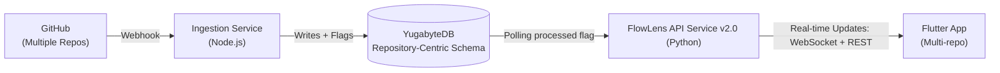

# FlowLens: The Intelligent Transactional System for Modern DevOps

**FlowLens is a real-time, AI-powered governance platform that transforms DevOps workflows into an intelligent transactional system. By ingesting live development data and applying ML-driven analysis, FlowLens provides the critical decision-making layer needed to manage code-to-production lifecycles at scale.**

This project is our solution for the **DevByZero Hackathon**, directly addressing **[Track #1 - Problem Statement 1: Intelligent Transactional System with Dynamic Data Processing](https://www.notion.so/Track-1-Problem-Statement-General-24dd1a10dbe2808f9c8fc0445e4f670a?pvs=21)**.

---

## 🌟 Key Innovations & Features

| Feature                                | Description                                                                                                                                  | Hackathon Keywords Addressed                                           |
| -------------------------------------- | -------------------------------------------------------------------------------------------------------------------------------------------- | ---------------------------------------------------------------------- |
| 🚀 **Event-Driven Microservices**      | A decoupled architecture with specialized services for data ingestion and AI processing, ensuring scalability and high availability.         | `Distributed Systems`, `Scalable Architecture`, `Technical Excellence` |
| 🧠 **AI-Powered Governance Layer**     | Utilizes a Google Gemini-powered engine to analyze code changes, assess risk, and provide intelligent approval recommendations in real time. | `AI/ML-driven decision-making`, `Intelligent System`, `Innovation`     |
| 🗄️ **Distributed & Fault-Tolerant**    | Built on **YugabyteDB**, our system guarantees data integrity and performance, mirroring real-world enterprise requirements for resilience.  | `YugabyteDB`, `Fault-tolerant performance`, `High Availability`        |
| 📱 **Unified Real-Time Observability** | A modern Flutter dashboard provides a single pane of glass into the entire DevOps lifecycle, from commit to production, for multiple roles.  | `Flutter-based interfaces`, `Rich Analytics`, `User Experience`        |

---

## 🏛️ A Scalable Microservices Architecture

Our system is designed for clarity and resilience, separating concerns to enable independent scaling and development.



### Core Components

- **[📦 Ingestion Service](./ingestion_service/):** The highly-available gateway that securely ingests and validates real-time events from GitHub.
- **[🧠 API Service](./api_service/):** The central brain of the platform, responsible for AI-powered decisioning, state management, and real-time broadcasting.
- **[📱 Flutter App](./flutter_app/):** The multi-role interface providing rich analytics and visualizations for developers, managers, and compliance teams.
- **[🗄️ YugabyteDB Backend](./docs/database.md):** The distributed SQL database providing the fault-tolerant, scalable persistence layer.

---

## 📖 Documentation Hub

We believe in clean code and even cleaner documentation. Our repository is structured for easy navigation and understanding, fulfilling the "Deployment Readiness" and "Code Quality" criteria.

- **[System Architecture](./docs/architecture.md)**: A deep dive into our distributed system's design and data flow.
- **[Database Guide](./docs/database.md)**: Detailed information on our YugabyteDB schema and setup.
- **[Flutter Application Guide](./docs/flutter_app.md)**: Documentation for the mobile client.

---

## 🎥 Live Demo

https://github.com/DevOps-Malayalam/DevByZero-Mission-Control/raw/main/flow-lens-demo.mp4

_Can't see the video?_ [](https://www.loom.com/share/4ca4a08ba3cb4876a341ca1a7d8ed10c)

---

## 🏁 Quick Start: The Full Stack

This guide provides the fastest way to get the entire FlowLens application running locally.

### 1. Prerequisites: Database Setup

Before you begin, ensure your database is ready.

- Follow the **[YugabyteDB Setup Guide](./docs/database.md#database-setup)** to configure your instance and apply the schema.

### 2. Run the Backend (Recommended: Docker)

The entire backend is orchestrated with Docker Compose for a simple, one-command launch.

- **[🚀 Follow the Docker Compose Guide](./README.md#-running-the-entire-backend-with-docker)** to build and run the `api-service` and `ingestion-service` containers.

This is the preferred method for a stable environment that mirrors a production setup.

### 3. Run the Flutter Application

With the backend running, you can now launch the mobile client.

1.  **Navigate to the app directory:**
    ```bash
    cd flutter_app
    ```
2.  **Install dependencies:**
    ```bash
    flutter pub get
    ```
3.  **Launch the app:**
    ```bash
    flutter run
    ```

**For Backend Developers:** If you need to run and debug a single backend service natively (without Docker), please see our **[Local Development Guide](./docs/development.md)**.

</br>

> ‎
> **</> Built by Mission Control | DevByZero 2025**
>
> _Defining the infinite possibilities in your DevOps pipeline._
> ‎
